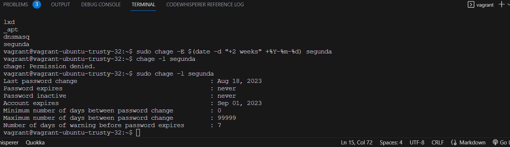

# Create a User on your virtual machine.

To create a new user on your vm, you first have to boot up the vm.

Open the termnal of choice and navigate to the directory that contains your vagrant file/virtual box.

Run the command 'vagrant up'

Connect to the vm using ssh with the command 'vagrant ssh'

First display the list of users on the vm, run the command 'awk -F':' '{ print $1 }' /etc/passwd'

Create a new user and set the user to expire after 2 weeks by running this command 'sudo useradd -m segunda'

Run this command to set the expiry date of the user 'sudo chage -E $(date -d "+2 weeks" +%Y-%m-%d) segunda'
Verify that changes were made with this command 'sudo chage -l segunda'

Set a new password for the user and mandate they change it on their next login with this command 'sudo passwd --expire segunda'

Create a new group with the command 'sudo groupadd altschool'

Add the user to the group altschool using the command 'sudo usermod -G altschool segunda'
[list of groups](img-9.png)

To allow altschool group to be able to run only cat command on /etc/, you have to edit the __sudoers__ file. To do this first run the command 'sudo visudo', this will open the file, and run the command '%altschool ALL=(root) /bin/cat /etc/*'
To view current permissions for the user in the group, run the command 'sudo -l -U segunda'
[list of groups](img-0.png)

To create a user without a home directory, run this command 'sudo useradd -M aladdin'
To verify that this has been done, run the command 'ls -l /home/aladdin'
[list of groups](img-a.png)
